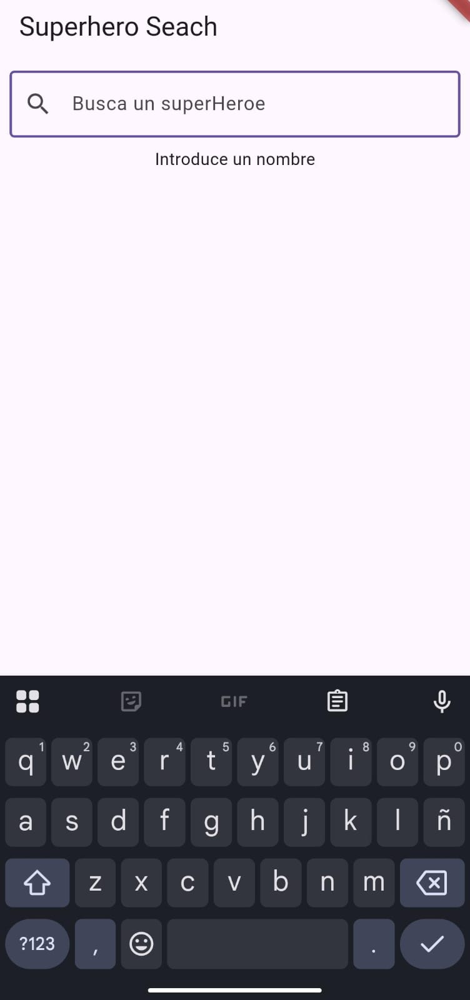
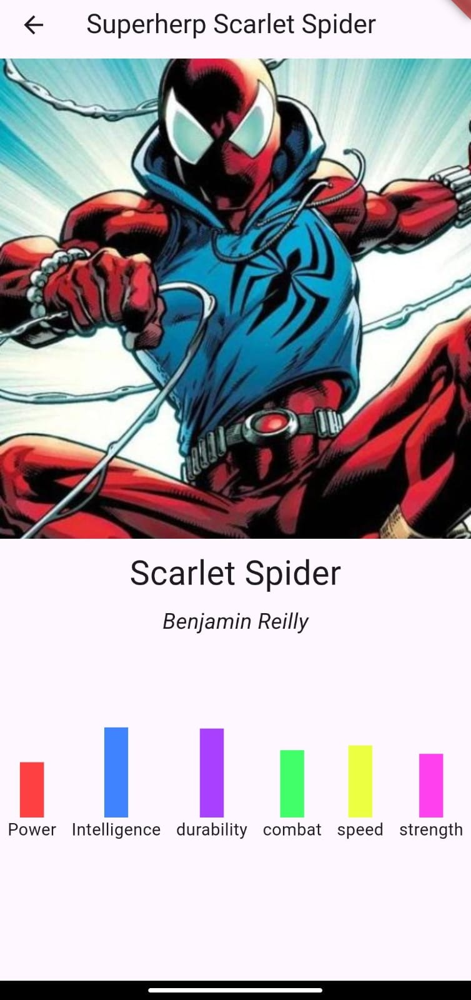

# 🦸‍♂️ Superhero App

Superhero App es una aplicación que permite buscar superhéroes y listar sus datos usando la API gratuita [SuperHeroAPI](https://superheroapi.com/). Es una práctica para aprender Flutter y Dart.

## 🚀 Características
- Búsqueda de superhéroes por nombre.
- Listado de información detallada sobre cada superhéroe.
- Integración con una API REST para obtener los datos.

## 🛠 Tecnologías utilizadas
- **Flutter** 🖥️ (Framework de UI para móviles)
- **Dart** 🏗️ (Lenguaje de programación)
- **SuperHeroAPI** 🔥 (Fuente de datos de superhéroes)

## 📸 Capturas de pantalla
<div align="center">
  
  
  
</div>

## 📦 Instalación
1. Clona este repositorio:
   ```bash
   git clone https://github.com/CristhofA/superherp_app
   ```
2. Entra en el directorio del proyecto:
   ```bash
   cd superhero_app
   ```
3. Instala las dependencias:
   ```bash
   flutter pub get
   ```
4. Ejecuta la app en un emulador o dispositivo:
   ```bash
   flutter run
   ```

## 📜 Licencia
Este proyecto es solo para fines de aprendizaje y práctica con Flutter y Dart. 🚀